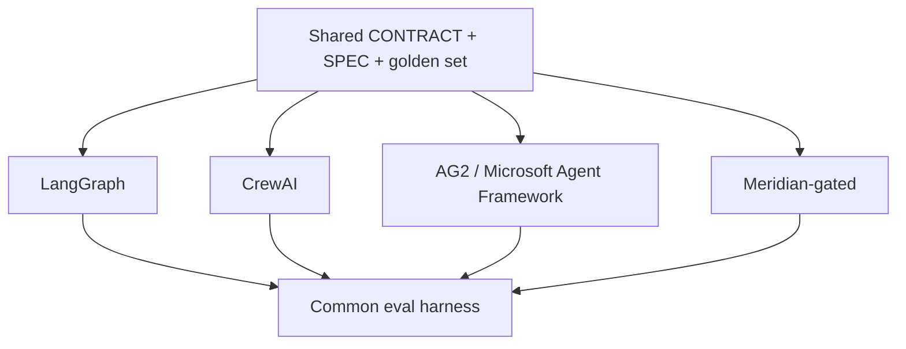

# agent-framework-bakeoff

Implements the **same** agent team four ways on one public, defense-shaped task and scores them with one eval harness.

**Status:** Scaffolding – Phase 0

Built on Meridian’s gate + independent Evaluator contracts. The point is trade-off literacy, not a framework tutorial.

## Relation to Meridian

One of the four implementations is Meridian-gated. The other three (LangGraph, CrewAI, AG2 / Microsoft Agent Framework) keep tools and prompts as similar as possible. Scoring uses [portfolio-kit](https://github.com/PCSchmidt/portfolio-kit) rubrics.

## Shared contracts

- [GATE_CONTRACT.md](https://github.com/PCSchmidt/portfolio-kit/blob/main/docs/GATE_CONTRACT.md)
- [EVAL_RUBRIC_TEMPLATE.md](https://github.com/PCSchmidt/portfolio-kit/blob/main/docs/EVAL_RUBRIC_TEMPLATE.md)
- [MEMORY_SCHEMA.md](https://github.com/PCSchmidt/portfolio-kit/blob/main/docs/MEMORY_SCHEMA.md)
- [DATA_POLICY.md](https://github.com/PCSchmidt/portfolio-kit/blob/main/docs/DATA_POLICY.md)

## Architecture

**Candidate public task:** given open-source satellite pass schedules plus public NOTAMs / ADS-B (or public GSA-style manifests), produce a daily airspace-risk or inventory-reconciliation brief with citations, discrepancy notes, and confidence scores.

## Planned phases

1. CONTRACT.md, SPEC.md, golden set of 30–50 cases
2. LangGraph baseline
3. CrewAI, AG2/MAF, Meridian-gated ports
4. Unified runner + score tables
5. Failure-mode write-up + AutoGen → Microsoft Agent Framework postmortem

## Public / unclassified data only

Fixtures will be public ADS-B / NOTAM / TLE / GSA-style extracts or synthetic CSVs. No JPO or F-35 content.

## Current tree

Phase 0 is documentation only.
