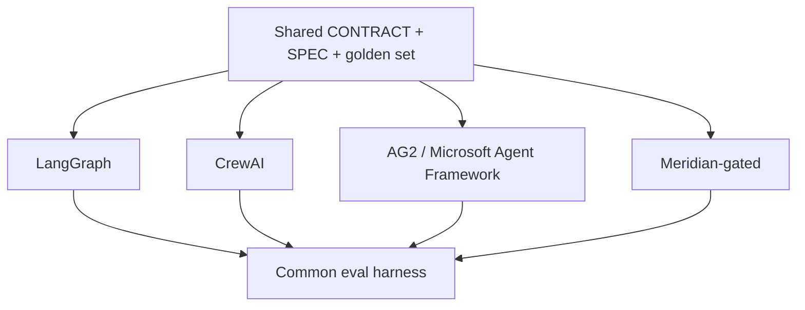

# agent-framework-bakeoff

Implements the **same** agent team four ways on one public, defense-shaped task and scores them with one eval harness.

**Status:** Phase 1 — CONTRACT / SPEC / golden set

Built on Meridian’s gate + independent Evaluator contracts. The point is trade-off literacy, not a framework tutorial. Phase 1 freezes the task so later ports cannot change the problem.

## Relation to Meridian

One of the four implementations is Meridian-gated. The other three (LangGraph, CrewAI, AG2 / Microsoft Agent Framework) keep tools and prompts as similar as possible. Scoring uses [portfolio-kit](https://github.com/PCSchmidt/portfolio-kit) rubrics.

## Shared contracts

- [GATE_CONTRACT.md](https://github.com/PCSchmidt/portfolio-kit/blob/main/docs/GATE_CONTRACT.md)
- [EVAL_RUBRIC_TEMPLATE.md](https://github.com/PCSchmidt/portfolio-kit/blob/main/docs/EVAL_RUBRIC_TEMPLATE.md)
- [MEMORY_SCHEMA.md](https://github.com/PCSchmidt/portfolio-kit/blob/main/docs/MEMORY_SCHEMA.md)
- [DATA_POLICY.md](https://github.com/PCSchmidt/portfolio-kit/blob/main/docs/DATA_POLICY.md)

## Architecture



**Frozen public task:** given synthetic public-style ADS-B, NOTAM, and TLE fixtures, produce a daily airspace-risk brief `{ airport, date }` with cited findings and confidence scores.

## Develop

```sh
npm test
npm run eval
```

Requires Node.js 20+. No dependencies, no network, no API keys.

## Golden set

[eval/cases.json](eval/cases.json) — 36 cases (`AIR-001`–`AIR-036`), 12 good / 24 known-bad.

Reports portfolio-kit **D3 gate-catch** on known-bad authored briefs and verdict agreement against [src/judge.js](src/judge.js). Target: catch ≥ 85% and 100% labeled agreement.

## Planned phases

1. CONTRACT.md, SPEC.md, golden set of 30–50 cases *(this increment)*
2. LangGraph baseline
3. CrewAI, AG2/MAF, Meridian-gated ports
4. Unified runner + score tables
5. Failure-mode write-up + AutoGen → Microsoft Agent Framework postmortem

## Public / unclassified data only

Fixtures are synthetic public-style ADS-B / NOTAM / TLE extracts. See [fixtures/SOURCES.md](fixtures/SOURCES.md). No JPO or F-35 content except as **known-bad** strings the judge must catch.

## Current tree

```
CONTRACT.md
SPEC.md
gates.yaml
fixtures/
eval/cases.json
eval/run.js
src/judge.js
src/world.js
tests/
```
